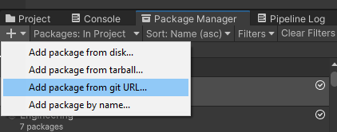
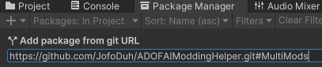
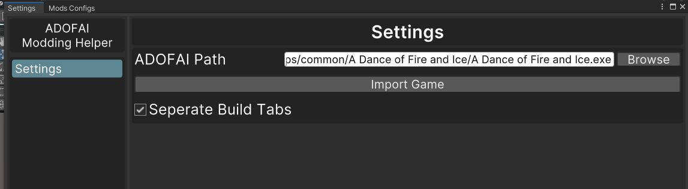

# ADOFAI Modding Helper
Unity package made for ADOFAI mod developers derived from [ADOFAI-Modding-Toolkit](https://github.com/ADOFAI-gg/ADOFAI-Modding-Toolkit). This package streamlines some process in mod development.
***
## Overview
- Uses Unity 2022.3.33f1 (must be in sync with the game)
- Uses [Harmony 2](https://harmony.pardeike.net/)
- Build options available at `Mods/Builds Config`, `Settings` under Unity Editor’s `ADOFAI Modding Helper` ribbon menu.
***
## Other Detail
- If you want to be able to make/manage multiple mods within the same Unity Project, then refer to the [MultiMods Branch](https://github.com/JofoDuh/ADOFAIModdingHelper/tree/MultiMods). The main branch only supports one mod per Unity Project.
***
## Setup
1. Install ADOFAI Modding Helper
    - ## Package Manager
     
     * Head over to the package manager in your Unity Project. Hit the plus in the top left of the panel, and click "Add package from git URL".
        
    
     * Then paste `https://github.com/JofoDuh/ADOFAIModdingHelper.git` into the field and click add afterwards.
2. Import ADOFAI

     * Open the settings via `Settings` under Unity Editor’s `ADOFAI Modding Helper` ribbon menu. Then, enter the path to the ADOFAI executable and click import. Click `Yes, continue` to import, and update `.dll`s when prompted.
        
    
***
# Run ADOFAI Toolbar

* **Run** - Build accordingly to the build configuration.
* **FRun** - Quickly launch the executable.
***
## License
MIT; Refer to [LICENSE](LICENSE.txt).

For files under [Editor](Editor), refer to [/Editor/LICENSE](<Editor/LICENSE.txt>).